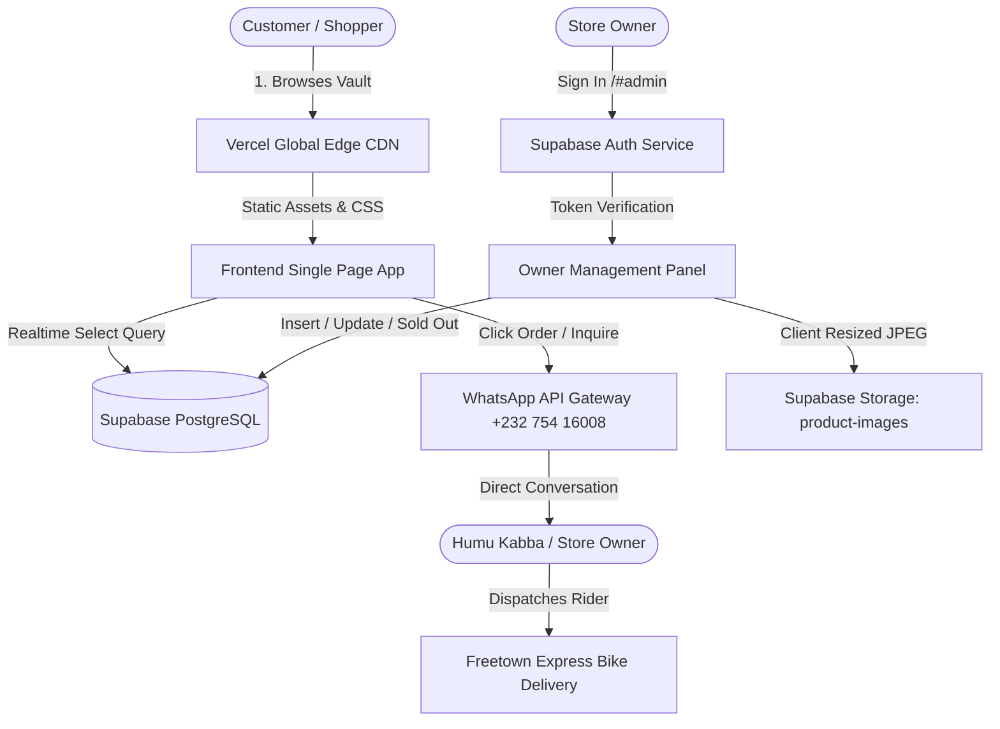
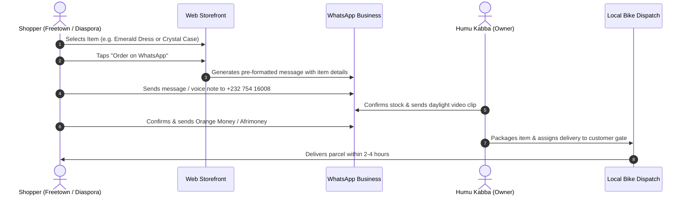
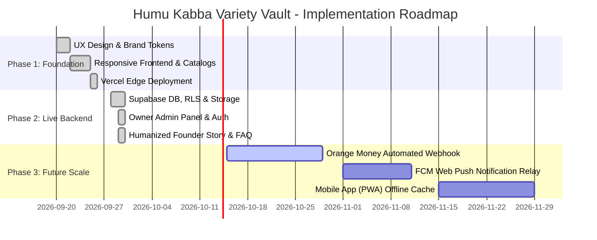

# Project Proposal & System Documentation
## Digital Boutique Platform & Realtime WhatsApp Commerce Engine
**Client & Brand:** Humu Kabba Variety Vault  
**Location:** 4B Johnson Land, Aberdeen, Freetown, Sierra Leone (Back of the Community Field)  
**Hotline & WhatsApp:** +232 754 16008  
**Live Production Prototype:** [https://humu-kabba-vault.vercel.app](https://humu-kabba-vault.vercel.app)  
**Date:** September 2026  
**Document Version:** 2.0 (Executive Edition)

---

## 1. Executive Summary

### 1.1 The Vision
For over seven years, **Humu Kabba Variety Vault** has operated as one of Aberdeen, Freetown’s premier fashion and lifestyle boutiques. With the slogan *"Your Style, Our Priority"* and founding tagline *"Check us now and get the value worth your money,"* the business has earned a loyal clientele spanning personal shoppers, wedding entourages, red-carpet attendees, and commercial boutique resellers in Freetown and provincial towns (Bo, Makeni, Kenema, Kono).

This proposal documents the **comprehensive digital transformation** and **live interactive prototype** designed to scale Humu Kabba Variety Vault from a local brick-and-mortar storefront into a 24/7 omnichannel commerce brand across Sierra Leone and the diaspora.

```
       ┌────────────────────────────────────────────────────────┐
       │               HUMU KABBA VARIETY VAULT                 │
       │           Omnichannel Commerce Architecture            │
       └───────────────────────────┬────────────────────────────┘
                                   │
         ┌─────────────────────────┼─────────────────────────┐
         ▼                         ▼                         ▼
┌──────────────────┐     ┌──────────────────┐     ┌──────────────────┐
│  Web Storefront  │     │   Admin Vault    │     │ WhatsApp Engine  │
│  (Next-Gen UI)   │     │ (Owner CMS & DB) │     │ (Order & Video)  │
└────────┬─────────┘     └────────┬─────────┘     └────────┬─────────┘
         │                         │                         │
         └─────────────────────────┼─────────────────────────┘
                                   ▼
                 ┌──────────────────────────────────┐
                 │       Freetown Fulfillment       │
                 │ Bike Dispatch • Orange / AfriPay │
                 └──────────────────────────────────┘
```

### 1.2 Core Objectives
1. **Humanized Customer Journey:** Maintain the warmth, personal care, and high-trust relationship of Humu Kabba while automating digital catalog discovery.
2. **Frictionless WhatsApp Ordering:** Zero-barrier checkout allowing customers to initiate pre-formatted orders and request real-time 360° daylight video clips.
3. **Realtime Cloud Backend:** Powered by Supabase (PostgreSQL, Row Level Security, Realtime subscriptions, and object storage for client-compressed high-res photography).
4. **Local Payment Alignment:** Built for the Sierra Leone economy, integrating payment workflows for **Orange Money**, **Afrimoney**, **Cash on Delivery**, and **Local Bank Transfer**.
5. **Exclusive Product Focus:** Dedicated spotlight for new drops, such as the exclusive **iPhone 17 Pro Max luxury case series** alongside luxury evening dresses, Italian leather handbags, and fine perfumes.

---

## 2. Brand Architecture & Market Positioning

| Parameter | Specification |
|---|---|
| **Official Name** | Humu Kabba Variety Vault |
| **Founder & Creative Director** | Humu Kabba |
| **Primary Physical Address** | 4B Johnson Land, Aberdeen, Freetown, Sierra Leone |
| **Landmark** | Back of the Aberdeen Community Field (easy access via Aberdeen Road) |
| **Operating Hours** | Mon–Sat: 09:00 – 19:00 GMT \| Sun: 13:00 – 17:00 GMT \| WhatsApp: 24/7 |
| **Market Segment** | High-end fashion retail, luxury accessories, and wholesale reseller supply |
| **Key Curations** | Evening Gala Dresses, Designer Leather Handbags, Extrait de Parfum, Embellished Stiletto Heels, Sculpting Denim, iPhone 17 Pro Max Cases |

---

## 3. System Architecture & Tech Stack



### 3.1 Technology Stack Details
- **Frontend Layer:** Semantic HTML5, Vanilla CSS3 (custom luxury design tokens, fluid clamp sizing, dark gold glassmorphic palette), Vanilla ES6+ JavaScript.
- **Backend & Database:** Supabase PostgreSQL with Row Level Security (RLS) policies, UUID v4 primary keys, and security-definer authorization functions.
- **Live State & Realtime:** Supabase WebSocket Realtime subscriptions syncing product availability and customer reviews across all visitor browsers instantly.
- **Hosting & CDN:** Vercel Edge Network with sub-50ms latency in West Africa and global multi-region caching.
- **Image Pipeline:** Browser-side canvas resizing engine scaling uploaded raw smartphone photography down to high-density 900px JPEGs before upload.

---

## 4. Database Schema Specification

The database runs in a hardened PostgreSQL environment on Supabase. Below is the operational table structure:

```sql
-- 1. Admins Verification Table
create table public.admins (
  user_id uuid primary key references auth.users(id) on delete cascade,
  created_at timestamptz default now()
);

-- 2. Products Table
create table public.products (
  id uuid primary key default gen_random_uuid(),
  name text not null,
  category text not null default 'Phone Cases',
  colors text default '',
  price numeric default null,
  description text default '',
  image_url text default '',
  in_stock boolean default true,
  created_at timestamptz default now()
);

-- 3. Customer Reviews Table
create table public.reviews (
  id uuid primary key default gen_random_uuid(),
  name text not null,
  item text not null,
  rating integer not null check (rating >= 1 and rating <= 5),
  text text not null,
  created_at timestamptz default now()
);

-- 4. Inbound WhatsApp Orders Audit Log
create table public.orders (
  id uuid primary key default gen_random_uuid(),
  product_name text not null,
  customer_name text default 'Anonymous Customer',
  phone text default '',
  order_type text default 'retail',
  notes text default '',
  status text not null default 'new',
  created_at timestamptz default now()
);
```

---

## 5. Prototype Walkthrough & User Flows

### 5.1 Interactive Prototype Screen Breakdown

#### Screen 1: Top Navigation & Real-time Store Hours Bar
- **Real-time UTC/GMT Clock Calculation:** Accurately reflects Africa/Freetown time. Automatically updates every 30 seconds to show `"Open Today (Closes 19:00)"` or `"Closed now, opens tomorrow at 09:00"`.
- **Direct WhatsApp Top Action:** Instant link with pre-filled greeting.

#### Screen 2: Luxury Hero Section
- **Curated Badges:** `7+ Years in Aberdeen`, `Handpicked with Love`, `Fast Freetown Delivery`, `WhatsApp Voice Notes Welcomed`.
- **Value Statement:** Welcoming copy emphasizing personalized styling and direct WhatsApp communication.

#### Screen 3: "Meet the Founder: Humu Kabba"
- **Humanizing Feature:** An editorial portrait and quote card from Humu herself explaining the 7-year boutique heritage, personal styling assistance, and the promise of 360° daylight video clips prior to payment.

#### Screen 4: The Vault Collections Grid & Live Filter
- **Multi-Category Tabs:** Interactive filtering across All Showcase, Bags & Accessories, Apparel & Dresses, Beauty & Perfumes, Footwear & Denim, and Phone Cases.
- **Dynamic Pricing:** Displays formatted `SLE` prices or elegant `"Ask price on WhatsApp"` buttons based on availability.

#### Screen 5: iPhone 17 Pro Max Cases Catalog (`cases.html`)
- Dedicated sub-page for high-demand cases: Crystal Shell, Heart Shell Crystal, and Monogram Leather-Look with optional wrist charms.
- Features real-time stock badges (`In Stock` / `Sold Out`).

#### Screen 6: Shopper FAQ Accordion
- Interactive accordion addressing local Freetown customer concerns:
  1. *Same-day bike rider delivery across Lumley, Wilberforce, Central, etc.*
  2. *Live WhatsApp 360° video previews.*
  3. *Payment methods (Orange Money, Afrimoney, Cash on Delivery, Bank Transfer).*
  4. *Upcountry delivery to Bo, Makeni, Kenema, Kono.*
  5. *Wholesale reseller bulk packs.*

#### Screen 7: Customer Reviews
- Social proof with customer initials avatars, verified customer checkmarks, Freetown location tags, and real customer feedback.

#### Screen 8: Owner Management CMS (`#admin`)
- Accessible only to authorized credentials (`mickykargbo3040@gmail.com`).
- Features client-side image compression, instant product publishing, single-click "Mark Sold Out", and inbound order tracking.

---

## 6. Functional Prototype Code Blueprint

Below is the standalone architectural prototype representing the core UI and logic of the platform:

```html
<!DOCTYPE html>
<html lang="en">
<head>
  <meta charset="UTF-8">
  <title>Prototype Preview - Humu Kabba Variety Vault</title>
  <style>
    :root {
      --bg-dark: #0a0a0c;
      --bg-card: #141418;
      --gold: #d4af37;
      --text: #ffffff;
      --text-muted: #a0a0aa;
      --wa-green: #25d366;
    }
    body {
      background: var(--bg-dark);
      color: var(--text);
      font-family: 'Segoe UI', system-ui, sans-serif;
      margin: 0; padding: 20px;
    }
    .preview-card {
      background: var(--bg-card);
      border: 1px solid rgba(212,175,55,0.3);
      border-radius: 12px;
      padding: 24px;
      max-width: 600px;
      margin: 0 auto;
    }
    .badge {
      display: inline-block;
      padding: 4px 10px;
      border-radius: 20px;
      background: rgba(212,175,55,0.15);
      color: var(--gold);
      font-size: 12px;
      font-weight: 600;
      margin-bottom: 12px;
    }
    h2 { margin: 0 0 8px; color: var(--gold); }
    p { color: var(--text-muted); font-size: 14px; line-height: 1.6; }
    .btn-wa {
      display: inline-flex;
      align-items: center;
      gap: 8px;
      background: var(--wa-green);
      color: #fff;
      text-decoration: none;
      padding: 12px 20px;
      border-radius: 8px;
      font-weight: 600;
      font-size: 14px;
      margin-top: 14px;
    }
  </style>
</head>
<body>
  <div class="preview-card">
    <span class="badge">7+ Years in Aberdeen, Freetown</span>
    <h2>Humu Kabba Variety Vault</h2>
    <p>
      "Your Style, Our Priority." Browse our handpicked fashion collections, 
      request a live daylight video clip of any dress or case, and order 
      directly via WhatsApp with doorstep delivery across Freetown.
    </p>
    <a href="https://wa.me/23275416008?text=Hello%20Humu!%20I%20am%20testing%20the%20prototype." target="_blank" class="btn-wa">
      Chat with Humu on WhatsApp (+232 754 16008)
    </a>
  </div>
</body>
</html>
```

---

## 7. Operational Workflows

### 7.1 Customer Order & Fulfillment Flow


### 7.2 Wholesale Partnership Model
1. Reseller contacts Humu Kabba via the specialized wholesale WhatsApp trigger.
2. Humu shares the tiered wholesale rate sheet for minimum order quantities (MOQs).
3. Orders dispatched to provincial motor parks (e.g., Dove Court / Shell New Road) for reliable courier transport to Bo, Makeni, Kenema, and Kono.

---

## 8. Implementation Phases & Growth Roadmap



---

## 9. Proposal Acceptance & Sign-off

This proposal reflects the delivered and active digital platform for **Humu Kabba Variety Vault**. All deliverables are fully live, accessible, and ready for commercial operation.

- **Production URL:** [https://humu-kabba-vault.vercel.app](https://humu-kabba-vault.vercel.app)  
- **Source Code Repository:** [github.com/michaelkargbo/humu-kabba-vault](https://github.com/michaelkargbo/humu-kabba-vault)  
- **Lead Developer & System Architect:** Michael Kargbo  
- **Business Representative:** Humu Kabba (Founder & Owner)
